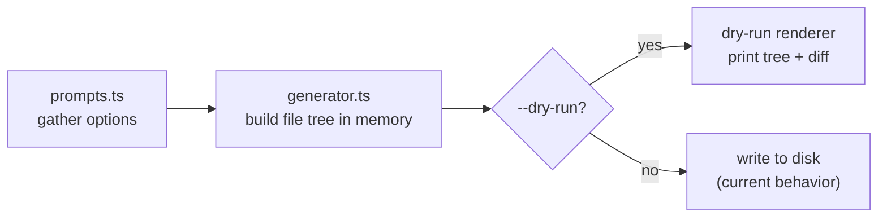
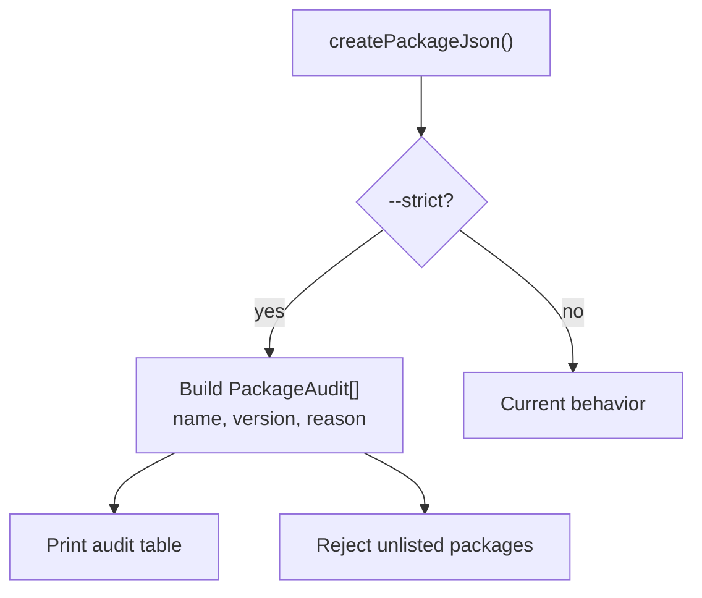

# Priority 1: Trust And Predictability — Implementation Plan

> **Roadmap items:** Dry-run & diff mode · Scaffold manifest · Strict package policy mode

---

## 1. Dry-Run And Diff Mode (`--dry-run`)

### Objective

Let users preview every file, dependency, and script change **before** anything touches disk.

### Design



The key insight is that [generator.ts](file:///home/marc/projects/qwykz/src/generator.ts) already builds content strings before calling `Bun.write()`. We intercept **after** content generation but **before** writes.

### Implementation Steps

| # | Task | Files touched | Notes |
|---|------|---------------|-------|
| 1 | Add `--dry-run` flag parsing in [prompts.ts](file:///home/marc/projects/qwykz/src/prompts.ts) | `src/prompts.ts`, `src/types.ts` | Add `dryRun: boolean` to `ProjectOptions` |
| 2 | Create `src/dry-run.ts` module | new file | Exports `renderDryRun(plan: ScaffoldPlan)` |
| 3 | Introduce a `ScaffoldPlan` type | `src/types.ts` | `{ files: Map<string, string>, packages: PackageMap, devPackages: PackageMap, scripts: Record<string, string> }` |
| 4 | Refactor `generateProject()` to return a `ScaffoldPlan` | `src/generator.ts` | Extract write logic into a separate `writePlan()` function; `generateProject()` returns the plan |
| 5 | Implement directory tree renderer | `src/dry-run.ts` | ASCII tree of all files that **would** be created |
| 6 | Implement package diff renderer | `src/dry-run.ts` | Show added `dependencies` and `devDependencies` with versions |
| 7 | Implement file content diff renderer | `src/dry-run.ts` | Unified diff of generated files (all additions for new projects) |
| 8 | Wire `--dry-run` into [cli.ts](file:///home/marc/projects/qwykz/src/cli.ts) | `src/cli.ts` | If `dryRun`, call `renderDryRun()` then exit before any writes or setup |
| 9 | Support `--yes --dry-run` combination | `src/prompts.ts` | Non-interactive dry-run for CI piping |
| 10 | Add tests | `tests/dry-run.test.ts` | Assert tree output, package listing, and diff output for a known stack |

### Acceptance Criteria

- [x] `qwykz --dry-run` prints directory tree, package list, and file diffs
- [x] `qwykz --yes --dry-run --framework express` works non-interactively
- [x] No files are created when `--dry-run` is active
- [x] Existing tests in [cli.test.ts](file:///home/marc/projects/qwykz/tests/cli.test.ts) and [e2e.test.ts](file:///home/marc/projects/qwykz/tests/e2e.test.ts) continue to pass

---

## 2. Scaffold Manifest

### Objective

Write a machine-readable `.qwykz-manifest.json` into every generated project so the scaffold is reproducible and inspectable.

### Schema

```json
{
  "$schema": "https://qwykz.dev/manifest.schema.json",
  "generator": {
    "name": "qwykz",
    "version": "1.4.4"
  },
  "scaffold": {
    "framework": "express",
    "dbTarget": "docker",
    "authTarget": "local",
    "cachingTarget": "none",
    "frontendFramework": null,
    "extraPackages": ["cors", "zod"]
  },
  "packages": {
    "dependencies": { "express": "^5.2.1", "...": "..." },
    "devDependencies": { "prisma": "^7.8.0", "...": "..." }
  },
  "templates": {
    "engine": "qwykz-template-v1",
    "checksums": {}
  },
  "createdAt": "2026-07-22T12:00:00Z"
}
```

### Implementation Steps

| # | Task | Files touched |
|---|------|---------------|
| 1 | Define `ScaffoldManifest` interface | `src/types.ts` |
| 2 | Create `src/manifest.ts` with `buildManifest(options, plan)` | new file |
| 3 | Call `buildManifest()` from `generateProject()` and include in `ScaffoldPlan` | `src/generator.ts` |
| 4 | Write `.qwykz-manifest.json` to the project root during `writePlan()` | `src/generator.ts` |
| 5 | Optionally store prompt answers when `--record-prompts` is passed | `src/prompts.ts`, `src/manifest.ts` |
| 6 | Add `.qwykz-manifest.json` assertion to [e2e.test.ts](file:///home/marc/projects/qwykz/tests/e2e.test.ts) | `tests/e2e.test.ts` |
| 7 | Add manifest schema validation test | `tests/manifest.test.ts` |
| 8 | Include manifest in `--dry-run` output | `src/dry-run.ts` |

### Acceptance Criteria

- [x] Every generated project contains `.qwykz-manifest.json` at root
- [x] Manifest records framework, db, auth, cache, packages, and generator version
- [x] Manifest is valid JSON and parseable by downstream tools
- [x] `--dry-run` includes a manifest preview section

---

## 3. Strict Package Policy Mode (`--strict`)

### Objective

Make package installation deterministic: only framework/runtime packages + explicitly selected extras, with a printed reason for each.

### Design

Currently [package-json.ts](file:///home/marc/projects/qwykz/src/package-json.ts) adds packages based on the selected stack. The strict mode wraps this in an audit trail.



### Implementation Steps

| # | Task | Files touched |
|---|------|---------------|
| 1 | Add `--strict` / `--policy locked` flag | `src/prompts.ts`, `src/types.ts` |
| 2 | Define `PackageAudit` type: `{ name, version, reason, category }` | `src/types.ts` |
| 3 | Refactor `createPackageJson()` to return `PackageAudit[]` alongside the package map | `src/package-json.ts` |
| 4 | Annotate every package addition with a reason string | `src/package-json.ts` |
| 5 | In strict mode, print an audit table before writing | `src/cli.ts` |
| 6 | In strict mode, error if any package lacks a reason | `src/package-json.ts` |
| 7 | Include audit in dry-run output | `src/dry-run.ts` |
| 8 | Include audit in manifest | `src/manifest.ts` |
| 9 | Add tests for strict mode audit and rejection | `tests/strict-policy.test.ts` |

### Acceptance Criteria

- [x] `qwykz --strict` prints a table showing every package and why it was added
- [x] No package is added without a category (core, auth, cache, extra, framework)
- [x] Strict mode errors if a package would be added without an explicit selection
- [x] Audit trail is recorded in the scaffold manifest

---

## Recommended Order

```
1. ScaffoldPlan refactor (shared prerequisite)
2. --dry-run
3. Scaffold manifest
4. --strict package policy
```

> [!TIP]
> The `ScaffoldPlan` refactor (extracting writes from `generateProject()`) is the foundation for all three features. Start there.

## Estimated Effort

| Feature | Complexity | Est. hours |
|---------|-----------|------------|
| ScaffoldPlan refactor | Medium | 4–6 |
| Dry-run renderer | Medium | 4–6 |
| Scaffold manifest | Low–Medium | 3–4 |
| Strict package policy | Medium | 4–6 |
| Tests for all three | Medium | 4–6 |
| **Total** | | **19–28** |
