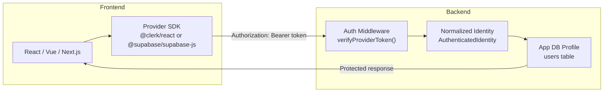
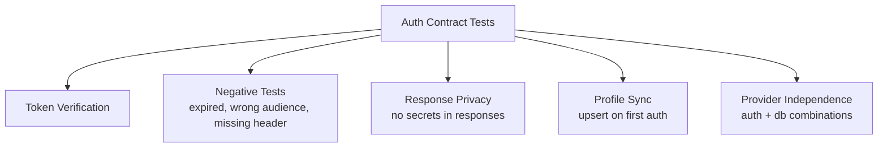

# Priority 2: Managed Fullstack Authentication — Implementation Plan

> **Roadmap item:** Production-ready Supabase Auth and Clerk
> **Detailed spec:** [fullstack-managed-auth-plan.md](file:///home/marc/projects/qwykz/docs/fullstack-managed-auth-plan.md)

---

## Architecture



> [!IMPORTANT]
> Auth selection and database selection must remain **completely independent**. Supabase Auth + Docker Postgres is a valid combination.

---

## Phase 0 — Contract & Audit (Prerequisite)

### Objective

Establish the normalized identity contract and audit the existing experimental code.

### Tasks

| # | Task | Files |
|---|------|-------|
| 1 | Define `AuthenticatedIdentity` interface | `src/types.ts` |
| 2 | Audit existing Supabase/Clerk middleware templates for security gaps | `templates/express/auth.middleware.supabase.ts`, `templates/express/auth.middleware.clerk.ts`, and equivalent for Hono/Elysia |
| 3 | Remove registration/login controllers from managed-auth backends (providers own these flows) | `templates/*/auth.controller.supabase.ts`, `templates/*/auth.controller.clerk.ts` |
| 4 | Define the auth contract test interface | `tests/auth-contract.ts` (new) |
| 5 | Create shared env schema distinguishing public vs private keys | `src/env-schema.ts` (new) |
| 6 | Add Vite output scan to reject server secrets in frontend bundles | `tests/auth-contract.ts` |

### `AuthenticatedIdentity` Contract

```typescript
interface AuthenticatedIdentity {
  provider: "supabase" | "clerk";
  providerUserId: string;
  email: string | null;
  sessionId: string | null;
  organizationId: string | null;
}
```

### Acceptance Criteria

- [ ] All managed-auth middleware templates verify tokens server-side (not trust client claims)
- [ ] Managed-auth backends expose `/api/auth/me` and `/api/users` but **not** `/api/auth/register` or `/api/auth/login`
- [ ] Environment schema separates `VITE_*` (public) from server-only secrets

---

## Phase 1 — Node.js Reference Implementations

### Objective

Ship verified Supabase Auth and Clerk for React/Vue + Express/Hono/Elysia.

### Tasks

| # | Task | Files |
|---|------|-------|
| 1 | **Supabase Auth + Express** — Update middleware to verify JWT via `@supabase/supabase-js` server client | `templates/express/auth.middleware.supabase.ts` |
| 2 | Create `/api/auth/me` controller that returns app profile linked to provider identity | `templates/express/auth.controller.supabase.ts` |
| 3 | Generate Prisma `User` model with `authProvider` + `providerUserId` unique constraint | Template for `schema.prisma` |
| 4 | Add profile upsert service on first `/api/auth/me` call | `templates/express/user.service.ts` |
| 5 | Repeat for **Hono** and **Elysia** backends | `templates/hono/`, `templates/elysia/` |
| 6 | **Clerk + Express** — Use `@clerk/clerk-sdk-node` `requireAuth()` middleware | `templates/express/auth.middleware.clerk.ts` |
| 7 | Create Clerk `/api/auth/me` controller | `templates/express/auth.controller.clerk.ts` |
| 8 | Repeat Clerk for **Hono** (`@clerk/backend` verifyToken) and **Elysia** | `templates/hono/`, `templates/elysia/` |
| 9 | Update React `App.tsx.stub` and `AuthContext.tsx.stub` for token forwarding | `templates/react/` |
| 10 | Update Vue `App.vue.stub` and `auth.ts.stub` for token forwarding | `templates/vue/` |
| 11 | Write auth contract integration tests | `tests/auth-contract.test.ts` |
| 12 | Add negative tests: expired tokens, wrong audience, missing headers | `tests/auth-contract.test.ts` |
| 13 | Update [generator.ts](file:///home/marc/projects/qwykz/src/generator.ts) auth conditional logic | `src/generator.ts` |

### Capability Matrix After Phase 1

| Frontend | Backend | Supabase Auth | Clerk | Local JWT |
|----------|---------|:---:|:---:|:---:|
| React | Express | ✅ | ✅ | ✅ |
| React | Hono | ✅ | ✅ | ✅ |
| React | Elysia | ✅ | ✅ | ✅ |
| Vue | Express | ✅ | ✅ | ✅ |
| Vue | Hono | ✅ | ✅ | ✅ |
| Vue | Elysia | ✅ | ✅ | ✅ |

### Acceptance Criteria

- [ ] All 12 combinations above pass the auth contract test suite
- [ ] Token verification happens server-side for both providers
- [ ] Application profiles are created on first authenticated request
- [ ] Frontend templates never contain server-only secrets

---

## Phase 2 — Next.js Framework-Native Review

### Objective

Validate that Next.js server-side auth uses framework-native patterns (not Express-style middleware).

### Tasks

| # | Task | Files |
|---|------|-------|
| 1 | Review Next.js Clerk middleware (`@clerk/nextjs`) for API routes | `templates/nextjs/clerk-middleware.ts.stub` |
| 2 | Review Next.js Supabase SSR (`@supabase/ssr`) for server components | `templates/nextjs/page.supabase.tsx.stub` |
| 3 | Add Next.js-specific auth contract tests | `tests/auth-contract.test.ts` |
| 4 | Update Next.js capability matrix entries | `docs/capability-matrix.md` |

### Acceptance Criteria

- [ ] Next.js uses `@clerk/nextjs` middleware (not raw SDK) for Clerk
- [ ] Next.js uses `@supabase/ssr` (not client-only) for Supabase
- [ ] Auth contract tests pass for Next.js API routes

---

## Phase 3 — Non-Node Backends

### Objective

Extend auth support to FastAPI, Laravel, Go, and Rust via verified JWT/JWKS adapters.

### Tasks

| # | Task | Files |
|---|------|-------|
| 1 | **FastAPI** — Add `python-jose` or `PyJWT` JWKS verification middleware | `templates/python/app/core/auth.py` (new) |
| 2 | **Laravel** — Use Sanctum guard with provider token exchange | `templates/laravel/` |
| 3 | **Go Fiber** — Add `golang-jwt/jwt` with JWKS fetching | `templates/go/internal/middleware/auth.go` |
| 4 | **Rust Axum** — Add `jsonwebtoken` crate with JWKS | `templates/rust/src/api/auth.rs` |
| 5 | All four must verify issuer, audience, and authorized parties | All of the above |
| 6 | Add Prisma/SQLAlchemy/Eloquent/GORM/SQLx user models with provider link | Framework-specific model files |
| 7 | Run auth contract tests per framework | `tests/auth-contract.test.ts` |

### Acceptance Criteria

- [ ] Each non-Node backend can verify both Supabase and Clerk tokens
- [ ] JWKS caching with safe refresh intervals is implemented
- [ ] Provider outage returns 503 (not 500)

---

## Phase 4 — Webhooks & Organizations (Optional)

### Objective

Add opt-in webhook receivers and organization/team mapping.

### Tasks

| # | Task |
|---|------|
| 1 | Add `--auth-webhooks` flag to enable webhook endpoint generation |
| 2 | Generate Clerk webhook handler for `user.created`, `user.updated`, `user.deleted` |
| 3 | Generate Supabase webhook handler for auth events |
| 4 | Map provider organizations/teams to application roles |
| 5 | Add webhook signature verification |

---

## Testing Strategy



> [!WARNING]
> Tests that require live provider credentials (Supabase project, Clerk app) should be gated behind `QWYKZ_RUN_MANAGED_CREDENTIAL_SMOKE=1`, matching the existing pattern in [managed-credentials.test.ts](file:///home/marc/projects/qwykz/tests/managed-credentials.test.ts).

---

## Prompt Matrix Gating Rule

> A combination may only appear in the interactive prompt **after** its auth contract tests pass in CI.

This means [prompts.ts](file:///home/marc/projects/qwykz/src/prompts.ts) must reference a capability registry that CI keeps up to date.

---

## Risks

| Risk | Mitigation |
|------|-----------|
| Provider SDK breaking changes | Pin supported major versions; add import checks to CI |
| Token accepted for wrong app | Validate issuer + audience + authorized parties |
| Secrets leaked to Vite bundle | Separate `VITE_*` public env schema; scan generated frontend output |
| Duplicate profiles | Unique constraint on `(authProvider, providerUserId)` |
| Client-controlled roles | Resolve roles from app DB only, never from client JWT claims |

---

## Estimated Effort

| Phase | Complexity | Est. hours |
|-------|-----------|------------|
| Phase 0 — Contract & audit | Medium | 6–8 |
| Phase 1 — Node.js (6 backend combos × 2 providers) | High | 20–30 |
| Phase 2 — Next.js review | Low–Medium | 4–6 |
| Phase 3 — Non-Node (4 languages × 2 providers) | High | 20–30 |
| Phase 4 — Webhooks & orgs | Medium | 8–12 |
| **Total** | | **58–86** |
