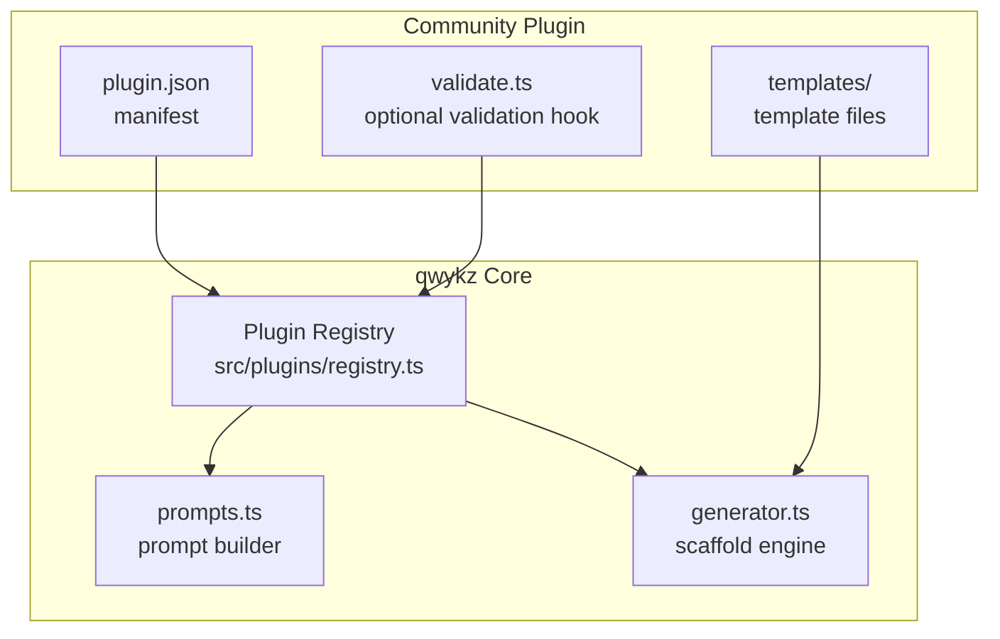
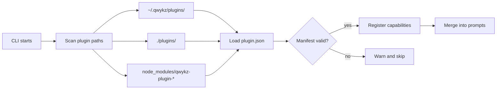
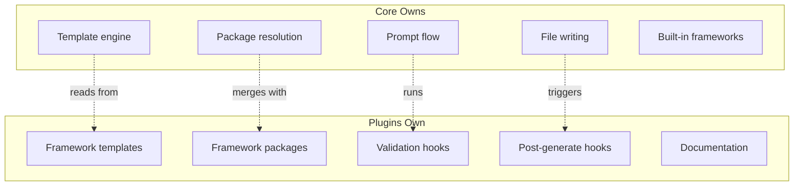

# Priority 3: Extensibility (Plugin System) — Implementation Plan

> **Roadmap item:** Plugin system for community-supported frameworks, auth providers, and deployment targets

---

## Objective

Let the community add new stacks, auth providers, and deployment targets **without editing core generator code**. Plugins register capabilities via a manifest and provide their own templates.

---

## Plugin Architecture



---

## Plugin Manifest Schema

Each plugin lives in a directory and must contain a `plugin.json`:

```json
{
  "$schema": "https://qwykz.dev/plugin.schema.json",
  "name": "qwykz-plugin-fastify",
  "version": "1.0.0",
  "description": "Fastify backend framework support for qwykz",
  "author": "community-contributor",
  "qwykzVersion": ">=1.5.0",

  "capabilities": {
    "frameworks": [
      {
        "name": "fastify",
        "label": "Fastify",
        "type": "backend",
        "language": "typescript",
        "runtime": "bun",
        "templateDir": "templates/fastify"
      }
    ],
    "authProviders": [],
    "deploymentTargets": []
  },

  "packages": {
    "dependencies": {
      "fastify": "^5.0.0",
      "@fastify/cors": "^10.0.0"
    },
    "devDependencies": {
      "@types/node": "^25.0.0"
    }
  },

  "scripts": {
    "dev": "bun --watch src/index.ts",
    "build": "bun build ./src/index.ts --outdir ./dist --target bun"
  },

  "validation": "validate.ts"
}
```

---

## Implementation Steps

### Phase A — Plugin Infrastructure

| # | Task | Files | Notes |
|---|------|-------|-------|
| 1 | Define `PluginManifest` and `PluginCapability` types | `src/plugins/types.ts` (new) | Framework, auth provider, and deployment target capability shapes |
| 2 | Create plugin registry module | `src/plugins/registry.ts` (new) | `loadPlugins()`, `getRegisteredFrameworks()`, `getRegisteredAuthProviders()` |
| 3 | Implement plugin discovery | `src/plugins/discovery.ts` (new) | Search in `~/.qwykz/plugins/`, `./plugins/`, and `node_modules/qwykz-plugin-*` |
| 4 | Implement manifest validation | `src/plugins/validate-manifest.ts` (new) | Reject invalid package sets, missing templates, version incompatibility |
| 5 | Add `--plugins-dir` CLI flag | `src/prompts.ts` | Override default plugin search paths |

### Phase B — Integration With Core

| # | Task | Files | Notes |
|---|------|-------|-------|
| 6 | Merge plugin frameworks into prompt choices | `src/prompts.ts` | Plugin frameworks appear alongside built-in ones; labeled with `[plugin]` |
| 7 | Extend `Framework` type to support dynamic values | `src/types.ts` | Move from union literal to branded string or extend the union |
| 8 | Route plugin framework generation through plugin templates | `src/generator.ts` | For plugin frameworks, read templates from plugin dir instead of `templates/` |
| 9 | Route plugin packages through `createPackageJson()` | `src/package-json.ts` | Merge plugin `packages` into the generated `package.json` |
| 10 | Support plugin auth providers | `src/generator.ts`, `src/prompts.ts` | Same pattern: register → prompt → generate |
| 11 | Support plugin deployment targets | `src/generator.ts`, `src/prompts.ts` | e.g., Vercel, Railway, Fly.io config generators |

### Phase C — Plugin Lifecycle

| # | Task | Files | Notes |
|---|------|-------|-------|
| 12 | Implement optional `validate.ts` hook | `src/plugins/registry.ts` | Plugin can export a `validate(options)` function called before generation |
| 13 | Implement optional `postGenerate` hook | `src/plugins/registry.ts` | Plugin can run commands or modify output after scaffolding |
| 14 | Plugin template variable injection | `src/template-engine.ts` | Plugin templates use the same `{{VARIABLE}}` syntax |
| 15 | Include plugin info in scaffold manifest | `src/manifest.ts` | Record which plugins were active and their versions |

### Phase D — Developer Experience

| # | Task | Files | Notes |
|---|------|-------|-------|
| 16 | Add `qwykz plugin init` subcommand | `src/cli.ts` | Scaffold a new plugin directory with `plugin.json`, `templates/`, and `validate.ts` |
| 17 | Add `qwykz plugin validate` subcommand | `src/cli.ts` | Validate a plugin manifest and template set without running generation |
| 18 | Add `qwykz plugin list` subcommand | `src/cli.ts` | List discovered plugins and their capabilities |
| 19 | Write plugin authoring guide | `docs/plugins.md` | How to create, test, and publish a plugin |
| 20 | Create reference plugin | `examples/qwykz-plugin-fastify/` | A working Fastify plugin as a template for community authors |

### Phase E — Tests

| # | Task | Files |
|---|------|-------|
| 21 | Plugin manifest validation tests | `tests/plugin-manifest.test.ts` |
| 22 | Plugin discovery tests (mock filesystem) | `tests/plugin-discovery.test.ts` |
| 23 | Plugin generation integration test | `tests/plugin-e2e.test.ts` |
| 24 | Reject invalid plugins (missing templates, bad versions) | `tests/plugin-manifest.test.ts` |

---

## Plugin Discovery Flow



---

## Validation Rules

Plugins are rejected if any of these conditions are true:

| Rule | Reason |
|------|--------|
| Missing `plugin.json` | Cannot determine capabilities |
| `qwykzVersion` incompatible with current CLI | Prevent runtime errors |
| Template directory missing or empty | Generation would produce nothing |
| Framework name conflicts with built-in | Prevent shadowing core behavior |
| Package names fail npm validation regex | Prevent injection attacks |
| `validation` script path resolves outside plugin dir | Security boundary |

---

## Plugin vs Core Boundary



> [!TIP]
> The core should never import plugin code directly. All interaction happens through the registry interface and template engine.

---

## Estimated Effort

| Phase | Complexity | Est. hours |
|-------|-----------|------------|
| Phase A — Plugin infrastructure | Medium | 8–10 |
| Phase B — Core integration | High | 10–14 |
| Phase C — Plugin lifecycle hooks | Medium | 6–8 |
| Phase D — DX (subcommands, guide, reference) | Medium | 6–8 |
| Phase E — Tests | Medium | 4–6 |
| **Total** | | **34–46** |
