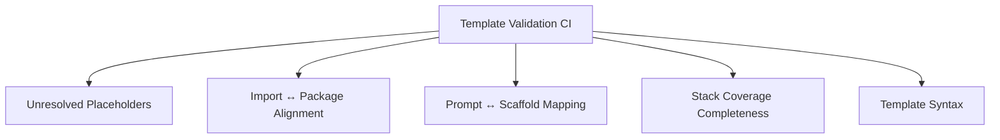

# Priority 4: Reliability Automation — Implementation Plan

> **Roadmap items:** Template validation CI · Generated app smoke tests

---

## Current State

The project already has significant test infrastructure:

| Test suite | File | Coverage |
|-----------|------|----------|
| Template engine unit tests | [template-engine.test.ts](file:///home/marc/projects/qwykz/tests/template-engine.test.ts) | Variable injection |
| CLI argument tests | [cli.test.ts](file:///home/marc/projects/qwykz/tests/cli.test.ts) | Flag parsing, prompt behavior |
| E2E scaffold tests | [e2e.test.ts](file:///home/marc/projects/qwykz/tests/e2e.test.ts) | File output verification |
| Full matrix tests | [full-matrix.test.ts](file:///home/marc/projects/qwykz/tests/full-matrix.test.ts) | All stack combinations |
| Runtime smoke tests | [runtime-smoke.test.ts](file:///home/marc/projects/qwykz/tests/runtime-smoke.test.ts) | 88 cases, 0 failures ([report](file:///home/marc/projects/qwykz/docs/runtime-smoke-report-2026-07-15.md)) |
| Managed credential tests | [managed-credentials.test.ts](file:///home/marc/projects/qwykz/tests/managed-credentials.test.ts) | Live Supabase/Clerk/Upstash |

---

## Feature 6: Template Validation CI

### Objective

Statically verify that templates, prompts, manifests, and package selections stay aligned — catching drift before it reaches users.

### Validation Checks



### Implementation Steps

| # | Task | Files | Notes |
|---|------|-------|-------|
| 1 | Create `src/validation/` module | new directory | Dedicated validation logic, separate from generation |
| 2 | **Placeholder scanner** — find unresolved `{{VARIABLE}}` in generated output | `src/validation/placeholders.ts` | Run `injectVariables()` for every stack combo and assert no `{{...}}` remain |
| 3 | **Import/package checker** — parse generated TS/JS for `import` statements and verify each package is in the generated `package.json` | `src/validation/imports.ts` | Uses regex or lightweight AST; also check `require()` |
| 4 | **Prompt/scaffold mapper** — verify every prompt option produces valid output | `src/validation/prompt-mapping.ts` | Enumerate all prompt choices × supported combos, assert each maps to a real template path |
| 5 | **Coverage completeness checker** — assert tests exist for every supported stack combo | `src/validation/coverage.ts` | Compare the full matrix from [full-matrix.test.ts](file:///home/marc/projects/qwykz/tests/full-matrix.test.ts) against the prompt options |
| 6 | **Template syntax checker** — validate template files have balanced `{{}}`, correct stub extensions | `src/validation/syntax.ts` | Catch typos like `{{PROJECT_NAM}}` |
| 7 | Create `bun run validate:templates` script | `package.json` | Runs all validators |
| 8 | Add GitHub Actions workflow | `.github/workflows/template-validation.yml` | Runs on every PR and push to main |
| 9 | Write tests for validators themselves | `tests/template-validation.test.ts` | Feed known-bad templates and assert detection |

### Validator Output Format

```
✅ Placeholder check: 0 unresolved variables across 10 framework templates
✅ Import alignment: all 147 imports match package.json entries
⚠️  Prompt mapping: "monorepo + neon + clerk" has no template coverage
✅ Template syntax: all 89 template files have valid placeholder syntax
❌ Coverage gap: "fullstack-vue-go-docker-redis" missing from full-matrix.test.ts
```

### GitHub Actions Workflow

```yaml
name: Template Validation
on:
  pull_request:
  push:
    branches: [main]

jobs:
  validate:
    runs-on: ubuntu-latest
    steps:
      - uses: actions/checkout@v4
      - uses: oven-sh/setup-bun@v2
      - run: bun install
      - run: bun run validate:templates
```

### Acceptance Criteria

- [x] `bun run validate:templates` runs in under 30 seconds
- [x] CI fails if any template has unresolved placeholders
- [x] CI fails if a generated import doesn't match an installed package
- [x] CI reports prompt options that lack capability/template coverage

---

## Feature 7: Generated App Smoke Tests (Expansion)

### Objective

Build on the existing 88-case runtime smoke matrix to cover more edge cases and automate in CI.

### Current Baseline

From the [runtime smoke report](file:///home/marc/projects/qwykz/docs/runtime-smoke-report-2026-07-15.md):
- 76 default cases + 12 Laravel cases = **88 total runtime cases**
- All passing, 0 failures
- ~37 minutes total runtime

### Expansion Tasks

| # | Task | Files | Notes |
|---|------|-------|-------|
| 1 | Add auth smoke tests to runtime matrix | `tests/runtime-smoke.test.ts` | For each stack: test `/api/auth/register` with invalid payload → expect 400; test duplicate registration → expect 409 |
| 2 | Add Redis integration smoke tests | `tests/runtime-smoke.test.ts` | For Docker Redis stacks: verify cache set/get via a generated endpoint |
| 3 | Add Docker Compose validation for all stacks | `tests/runtime-smoke.test.ts` | `docker compose config` for every stack that generates a `docker-compose.yml` |
| 4 | Add typecheck verification | `tests/runtime-smoke.test.ts` | Run `tsc --noEmit` or `bun run typecheck` on generated Node.js projects |
| 5 | Add build verification | `tests/runtime-smoke.test.ts` | `bun build`, `go build`, `cargo check` on generated projects |
| 6 | Add Neon database target smoke tests | `tests/runtime-smoke.test.ts` | Verify `.env` has Neon connection string placeholder, typecheck passes |
| 7 | Create runtime smoke CI workflow (scheduled) | `.github/workflows/runtime-smoke.yml` | Weekly scheduled run with Docker services |
| 8 | Create runtime smoke CI workflow (release) | `.github/workflows/release-smoke.yml` | Required before any version tag |
| 9 | Add smoke test report generator | `scripts/generate-smoke-report.ts` | Auto-generate markdown report like the existing one |
| 10 | Track performance regressions | `tests/runtime-smoke.test.ts` | Record per-test timing; warn if >2x baseline |

### CI Matrix Strategy

```yaml
# Scheduled weekly smoke run
name: Runtime Smoke Tests
on:
  schedule:
    - cron: '0 6 * * 1'  # Monday 6 AM UTC
  workflow_dispatch:

jobs:
  smoke-default:
    runs-on: ubuntu-latest
    timeout-minutes: 60
    services:
      postgres:
        image: postgres:16
        env:
          POSTGRES_PASSWORD: postgres
        ports: ['5432:5432']
    steps:
      - uses: actions/checkout@v4
      - uses: oven-sh/setup-bun@v2
      - run: bun install
      - run: bun run test:runtime

  smoke-laravel:
    runs-on: ubuntu-latest
    timeout-minutes: 20
    steps:
      - uses: actions/checkout@v4
      - uses: oven-sh/setup-bun@v2
      - uses: shivammathur/setup-php@v2
        with:
          php-version: '8.3'
      - run: bun install
      - run: bun run test:runtime:laravel
```

### Smoke Test Coverage Map

| Surface | Current cases | Planned additions |
|---------|:---:|:---:|
| Backend API (Express/Hono/Elysia) | 24 | +6 (auth edge, Redis) |
| Backend API (Python/Go/Rust) | — (via runtime-smoke) | +3 (typecheck/build verify) |
| Backend API (Laravel) | 12 | +2 (auth edge) |
| Fullstack React | 24 | +6 (auth edge, Redis) |
| Fullstack Vue | 24 | +6 (auth edge, Redis) |
| Next.js | 4 | +2 (auth, build) |
| **Total** | **88** | **~113** |

### Acceptance Criteria

- [x] Runtime smoke tests run weekly in CI without manual intervention
- [x] Release pipeline blocks on smoke test failures
- [x] Smoke report is auto-generated after each run
- [x] Auth edge cases (bad payload, duplicate registration) are covered
- [x] All Docker Compose files pass `docker compose config`

---

## Estimated Effort

| Feature | Complexity | Est. hours |
|---------|-----------|------------|
| Template validation CI (6 validators) | Medium | 10–14 |
| GitHub Actions workflows | Low | 2–3 |
| Runtime smoke expansion | Medium | 8–12 |
| Smoke report generator | Low | 2–3 |
| **Total** | | **22–32** |
