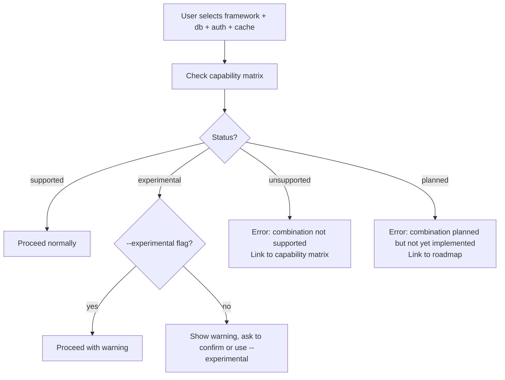
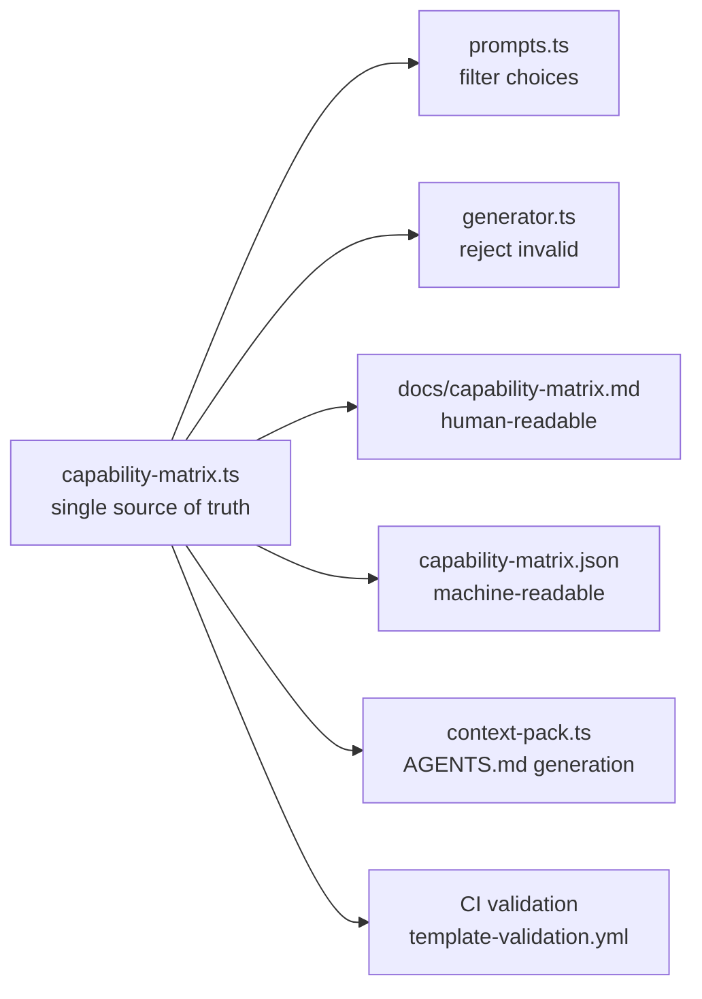

# Priority 5: AI-Assisted Developer Experience — Implementation Plan

> **Roadmap items:** AI context pack · Public capability matrix

---

## Feature 8: AI Context Pack

### Objective

Generate an `AGENTS.md` (or `AI_CONTEXT.md`) file in every scaffolded project so AI tools immediately understand the stack, folder structure, commands, and conventions — without wasting tokens rediscovering the scaffold.

### Why `AGENTS.md`?

This project already uses [AGENTS.md](file:///home/marc/projects/qwykz/AGENTS.md) for its own repository. Generating one per scaffold ensures every qwykz user gets AI-ready projects out of the box.

### Generated Content Template

The context file is dynamically assembled from `ProjectOptions` and the `ScaffoldManifest`:

```markdown
# AGENTS.md

## Stack
- Framework: Express (TypeScript, Bun runtime)
- Database: Docker PostgreSQL (port 5432)
- Auth: Local JWT (Argon2 + jsonwebtoken)
- Caching: Docker Redis (port 6379)
- ORM: Prisma

## Folder Structure
```
src/
├── index.ts          # Entry point
├── server.ts         # Express app setup
├── routes/
│   ├── auth.routes.ts
│   ├── health.routes.ts
│   └── user.routes.ts
├── controllers/
│   ├── auth.controller.ts
│   └── user.controller.ts
├── services/
│   └── user.service.ts
├── middleware/
│   ├── auth.middleware.ts
│   └── error.middleware.ts
└── lib/
    ├── prisma-client.ts
    └── wait-for-postgres.ts
prisma/
└── schema.prisma
```

## Commands
| Command | Purpose |
|---------|---------|
| `bun run dev` | Start dev server with hot reload |
| `bun run build` | Build for production |
| `bun run db:push` | Push Prisma schema to database |
| `bun run db:generate` | Regenerate Prisma client |
| `bun run typecheck` | Run TypeScript type checking |
| `docker compose up -d` | Start PostgreSQL + Redis containers |

## How To Add...
- **A new route**: Create `src/routes/NAME.routes.ts`, add to `src/server.ts`
- **A new service**: Create `src/services/NAME.service.ts`
- **A migration**: Edit `prisma/schema.prisma`, run `bun run db:push`
- **A test**: Create `tests/NAME.test.ts`, run `bun test`

## Auth Model
- Sign-up: POST `/api/auth/register` with `{ email, password }`
- Sign-in: POST `/api/auth/login` with `{ email, password }`
- Protected routes use Bearer token in Authorization header
- Passwords hashed with Argon2, tokens signed with jsonwebtoken

## Environment
- `.env` file with `DATABASE_URL`, `JWT_SECRET`, `REDIS_URL`
- Docker Compose manages PostgreSQL and Redis
```

### Implementation Steps

| # | Task | Files | Notes |
|---|------|-------|-------|
| 1 | Create `src/context-pack.ts` module | new file | Exports `generateContextPack(options, manifest): string` |
| 2 | Build folder structure section dynamically | `src/context-pack.ts` | Use the `ScaffoldPlan` file list to generate an ASCII tree |
| 3 | Build commands section from generated `scripts` | `src/context-pack.ts` | Map `package.json` scripts, `docker compose`, framework-specific commands |
| 4 | Build "How to add" section per framework | `src/context-pack.ts` | Framework-specific patterns (Express routes vs Hono routes vs FastAPI endpoints) |
| 5 | Build auth model section | `src/context-pack.ts` | Different content for local JWT vs Supabase Auth vs Clerk |
| 6 | Build environment section | `src/context-pack.ts` | List required env vars without exposing values |
| 7 | Write `AGENTS.md` during `writePlan()` | `src/generator.ts` | Add to project root |
| 8 | Include in `--dry-run` output | `src/dry-run.ts` | Show the generated context pack content |
| 9 | Add `--no-ai-context` flag to opt out | `src/prompts.ts`, `src/types.ts` | Some users may not want this file |
| 10 | Add framework-specific context templates | `src/context-pack.ts` | Go, Rust, Python, Laravel all have different conventions |
| 11 | Test context pack generation | `tests/context-pack.test.ts` | Assert key sections present for each framework |
| 12 | Sync context pack with scaffold manifest data | `src/context-pack.ts`, `src/manifest.ts` | Both derive from the same `ProjectOptions` |

### Per-Framework Context Variations

| Framework | Entry point | Route pattern | ORM | Package manager |
|-----------|------------|---------------|-----|----------------|
| Express | `src/index.ts` | `router.get()` | Prisma | bun |
| Hono | `src/index.ts` | `app.get()` | Prisma | bun |
| Elysia | `src/index.ts` | `app.get()` | Prisma | bun |
| Next.js | `app/page.tsx` | `app/api/` routes | Prisma | bun |
| FastAPI | `app/main.py` | `@app.get()` decorators | SQLAlchemy | pip |
| Go Fiber | `cmd/api/main.go` | `app.Get()` | GORM | go mod |
| Rust Axum | `src/main.rs` | `Router::new().route()` | SQLx | cargo |
| Laravel | `routes/api.php` | `Route::get()` | Eloquent | composer |

### Acceptance Criteria

- [x] Every generated project contains `AGENTS.md` at root
- [x] Content is factual and derived from the same metadata as the manifest
- [x] AI tools can use the file to navigate the project without additional prompting
- [x] Context pack covers all 10 framework templates
- [x] `--no-ai-context` suppresses generation

---

## Feature 9: Public Capability Matrix

### Objective

Make supported combinations explicit so users (and AI tools) know what works before generating a project.

### Matrix Format

#### Human-readable (README/docs)

| Stack | DB: Docker | DB: Local | DB: Supabase | DB: Neon | Auth: Local | Auth: Supabase | Auth: Clerk | Cache: Redis | Cache: Upstash | Dockerfile |
|-------|:---:|:---:|:---:|:---:|:---:|:---:|:---:|:---:|:---:|:---:|
| Express | ✅ | ✅ | ✅ | ✅ | ✅ | 🧪 | 🧪 | ✅ | ✅ | ✅ |
| Hono | ✅ | ✅ | ✅ | ✅ | ✅ | 🧪 | 🧪 | ✅ | ✅ | ✅ |
| Elysia | ✅ | ✅ | ✅ | — | ✅ | 🧪 | 🧪 | ✅ | ✅ | ✅ |
| Next.js | ✅ | ✅ | ✅ | — | ✅ | 🧪 | 🧪 | — | — | — |
| FastAPI | ✅ | ✅ | — | — | ✅ | — | — | ✅ | — | ✅ |
| Go Fiber | ✅ | ✅ | — | — | ✅ | — | — | ✅ | — | ✅ |
| Rust Axum | ✅ | ✅ | — | — | ✅ | — | — | ✅ | — | ✅ |
| Laravel | ✅ | ✅ | — | — | ✅ | — | — | ✅ | — | — |

**Legend:** ✅ = Supported & tested · 🧪 = Experimental · 📋 = Planned · — = Unsupported

#### Machine-readable (`capability-matrix.json`)

```json
{
  "version": "1.0.0",
  "generatorVersion": "1.4.4",
  "matrix": {
    "express": {
      "dbTargets": {
        "docker": "supported",
        "local": "supported",
        "supabase": "supported",
        "neon": "supported"
      },
      "authTargets": {
        "local": "supported",
        "supabase": "experimental",
        "clerk": "experimental"
      },
      "cachingTargets": {
        "none": "supported",
        "docker": "supported",
        "upstash": "supported"
      },
      "dockerfile": true,
      "frontends": ["react", "vue"]
    }
  },
  "statuses": ["supported", "experimental", "planned", "unsupported"]
}
```

### Implementation Steps

| # | Task | Files | Notes |
|---|------|-------|-------|
| 1 | Define `CapabilityMatrix` and `CapabilityStatus` types | `src/capability/types.ts` (new) | `supported`, `experimental`, `planned`, `unsupported` |
| 2 | Create `src/capability/matrix.ts` — the single source of truth | new file | Hard-coded matrix that prompts, docs, and CI all reference |
| 3 | Generate `docs/capability-matrix.md` from the matrix | `scripts/generate-capability-matrix.ts` (new) | Markdown table auto-generated |
| 4 | Generate `capability-matrix.json` alongside the docs | same script | Machine-readable version for AI tools and CI |
| 5 | Wire matrix into [prompts.ts](file:///home/marc/projects/qwykz/src/prompts.ts) | `src/prompts.ts` | Filter prompt choices to only show supported/experimental combos |
| 6 | Add `--experimental` flag to unlock experimental combos | `src/prompts.ts`, `src/types.ts` | Without this flag, only `supported` combos are offered |
| 7 | Reject unsupported combinations before writing files | `src/generator.ts` | Error with a clear message pointing to the capability matrix |
| 8 | Add matrix validation to CI | `.github/workflows/template-validation.yml` | Assert matrix entries align with available templates |
| 9 | Include matrix status in scaffold manifest | `src/manifest.ts` | Record whether the chosen combo was `supported` or `experimental` |
| 10 | Add matrix to README.md | `README.md` | Link to the full matrix doc |
| 11 | Test matrix enforcement | `tests/capability-matrix.test.ts` | Assert unsupported combos are rejected; experimental combos warn |
| 12 | Keep matrix synced with prompt options and tests | CI validation | The template validation CI (Priority 4) checks for alignment |

### Matrix Enforcement Flow



### Acceptance Criteria

- [x] `docs/capability-matrix.md` is auto-generated and up to date
- [x] `capability-matrix.json` is published alongside docs
- [x] Unsupported combinations are rejected with a helpful error
- [x] Experimental combinations require `--experimental` or explicit confirmation
- [x] Matrix aligns with available templates and test coverage
- [x] Matrix is referenced in README.md

---

## Cross-cutting: Sync Between Features



> [!IMPORTANT]
> Both features (AI context pack + capability matrix) should derive from the same `ProjectOptions` metadata. The matrix gates what gets offered; the context pack documents what was generated.

---

## Estimated Effort

| Feature | Complexity | Est. hours |
|---------|-----------|------------|
| AI context pack (10 framework variants) | Medium | 8–12 |
| Context pack tests | Low–Medium | 3–4 |
| Capability matrix (types + source of truth) | Medium | 4–6 |
| Matrix enforcement in prompts/generator | Medium | 4–6 |
| Matrix generation scripts | Low | 2–3 |
| Matrix CI integration | Low | 2–3 |
| **Total** | | **23–34** |
